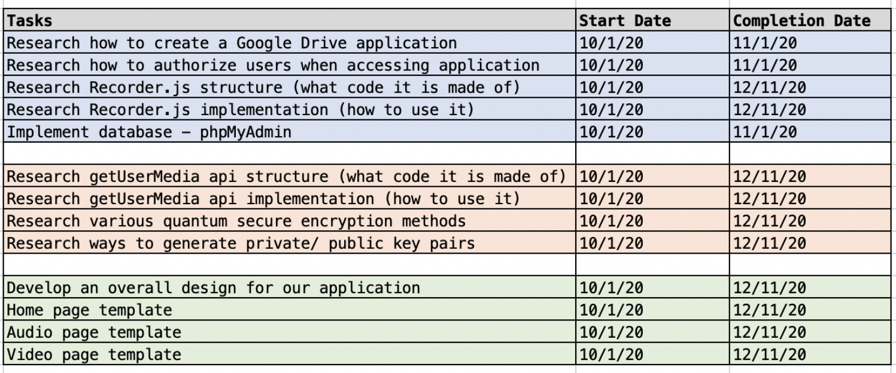
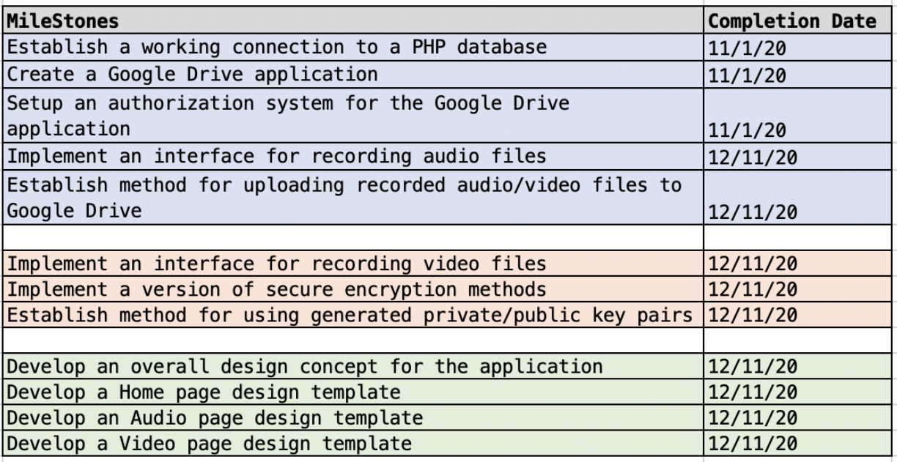
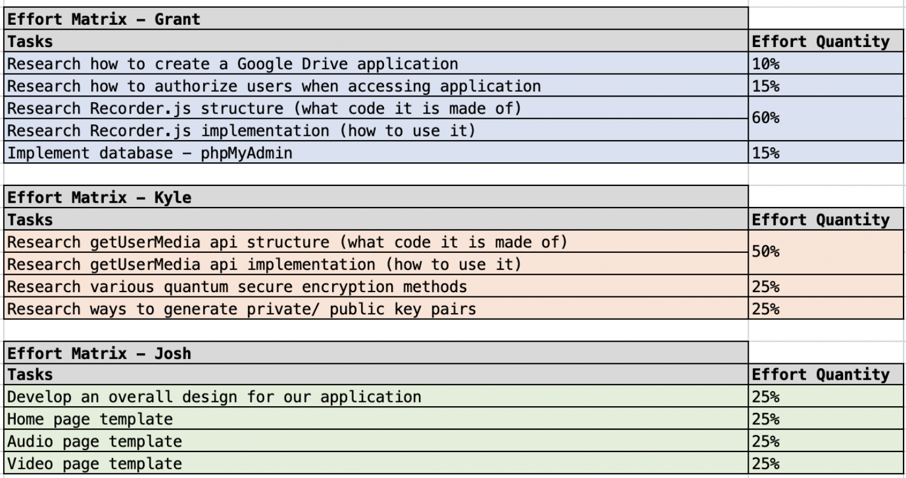

# Milestones

### Grant Galinger
* Establish a working connection to a PHP database
    * Establish a connection to the PHP database, phpMyAdmin. We will need to make sure that we are able to successfully send and retrieve data from this database
* Create a Google Drive application
    * Through the use of Googles developer tools, we need to create a “template” application for use of testing and building up our application components. 
* Setup an authorization system for the Google Drive application
    * Establish a workflow for the authorization type, OAuth2.0
* Implement an interface for recording audio files
    * Create the functionality for recording audio files and storing them into the database
* Establish method for uploading recorded audio/video files to Google Drive
    * Create the functionality for retrieving the audio/video files from the database and uploading them to Google Drive

### Josh Phillips
* Implement an interface for recording video files
    * Create the functionality for recording video files and storing them into the database
* Implement a version of secure encryption methods
* Establish method for using generated private/public key pairs

## Kyle Spraggins
* Develop an overall design concept for the application
    * Create and design the overall theme/aesthetic for the application
* Develop a Home page design template
    * Create the design layout for the Home page of the application
* Develop an Audio page design template
    * Create the design layout for the Audio page of the application
* Develop a Video page design template
    * Create the design layout for the Video page of the application

# Timeline

# Effort Matrix

