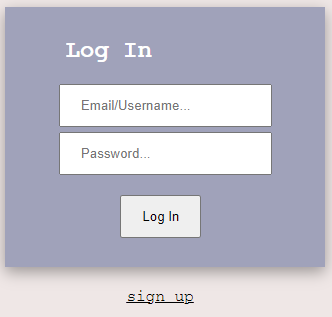
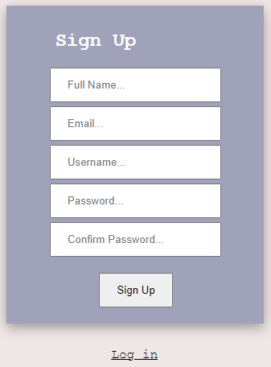

# EZ- Drive User Documentation

## Introduction
### This user documentation will be broken down into two main sections. Thie first being geared towards users interacting with our project in its end-state; meaning once it is hosted and accessible from the internet. The second being users who wish to clone our github repository and run our project locally on their own machine. 

### There is a distinct difference in the steps needed to use our project for each of these senarios, which is why we feel it is important to explain them separately. 

## Section 1.0 - End User Guide:
### With our project in its end-sate, the steps to utilizing its features are simple.
### 1) Log in or Sign Up to Create an Account
#### When you first reach our project, you will be directed to a Login page where you have the option of logging in or creating an account if you do not have one. Signing up requires little information. All that is needed is your name, a username, your email, and a password. Once your account is created you will be directed back to the Login page. 

<!--   -->

  
   

### 2) Connect Cloud Service Accounts
#### Once logged in, you will be taken to our Home page. Here, your account information is displayed, as well as the status for each of the cloud services we offer connection to. Those being: Google Drive, Dropbox, and OneDrive. In order to connect your cloud service accounts to our application simply click on the "connect" button next to each cloud service. This will take you through the authorization process of connecting your cloud service account. Essentially, you have to allow our application to access your cloud service account resources. By doing so, our application will be able to upload files to your connected cloud service accounts.

### 3) Upload Files
#### Once your desired cloud serive accounts are connected, you can proceed to uploading your files. From the Home page, click on the "go to uploads" button, or navigate there through the menu on the left. On the Upload page you can select the cloud serives you want to upload to by clicking the checkboxes. The cloud service accounts your are already connected to will be automaticlly checked for you. If you want to upload to a cloud service, lets say OneDrive, and you havent gone through the OneDrive authorization process, go ahead and click the checkbox. If this is the case, you will be promted to complete the authorization process upon executing the upload.

#### In order to upload your files simply drag and drop them into the upload box, or click the box to search through your computer. Once all your files are selected, simply click the "upload" button next to the checkboxes. This will execute the upload process and upon completion take you to the Results page. 

### 4) View Upload Results
#### Once your uploads have completed, you will be taken to the Results page where a list of the files you uploaded are displayed, as well as links to each of the cloud services if you wish to proceed to them. From here, you can return to the Home page or go back to the Upload page if you wish to upload additional files. 

## Section 2.0 - Cloning Repository for Local Usage
### This section if for users lookiong to clone our Github repository and setup and run our project locally on their own device. There are several steps needed for this to work properly.
### 1) Download and Install PHP Webserver
#### - WAMPServer for Windows - recommended
#### - Apache for Mac - recommended

### 2) Download and Install Composer Dependency Manager

### 2) Clone Repository
#### - create db tables
#### - run composer script