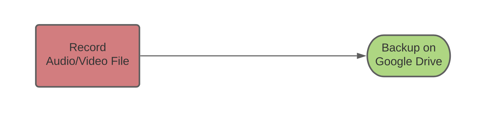
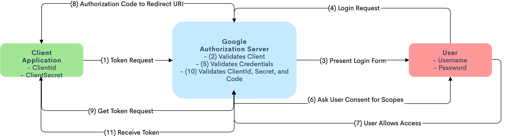

# Design Diagrmas

### D0:
At the most basic level, this application will allow users to record and save audio and video file to their Google Drive account

* Record audio/video file -> backup on Google Drive

### D1:
More specifically, the application will be using the Google Drive API in order to access their Google Drive accounts.

* User logs in through Google account -> User is authenticated -> Use getUserMedia API for recording audio/video files -> upload files to Google Drive

### D2:
MORE specifically, this application will be utilizing OAuth 2.0 authorization to authorize users.

OAuth2.0:
1.	Application supplies a client_id, client_secret, and authorization_server
2.	When a user tries to access our web application, they will be presented with a login form. The user will then login into their Google account.
3.	Google will then ask for consent for the scopes provided i.e. “drive” and the user will need to accept in order to continue.
4.	The Google Authorization Server will then send the authorization_code and redirect_uri to the application. 
5.	The application will then take that authorization_code, along with the client_id and client_secret to request a token from the Google Authorization Server.
6.	The server will send back a token, which will allow the application to access the users Google Drive account.

Audio/Video Recording:
1.	User clicks “Record” to begin recording and “Stop” when finished recording
2.	An audio/video (.wav/.mp4) file is formatted with the aforementioned library and API
3.	User can record multiple files before uploading (repeat steps 1 & 2)
4.	Upload files to Google Drive (See “Upload to Drive” section)

Upload to Drive:
1.	A “GoogleDrive_Service” class is created with the client information
2.	The recorded files are looped through and prepared for uploading
3.	User clicks “Upload” and files are uploaded to their Drive account
